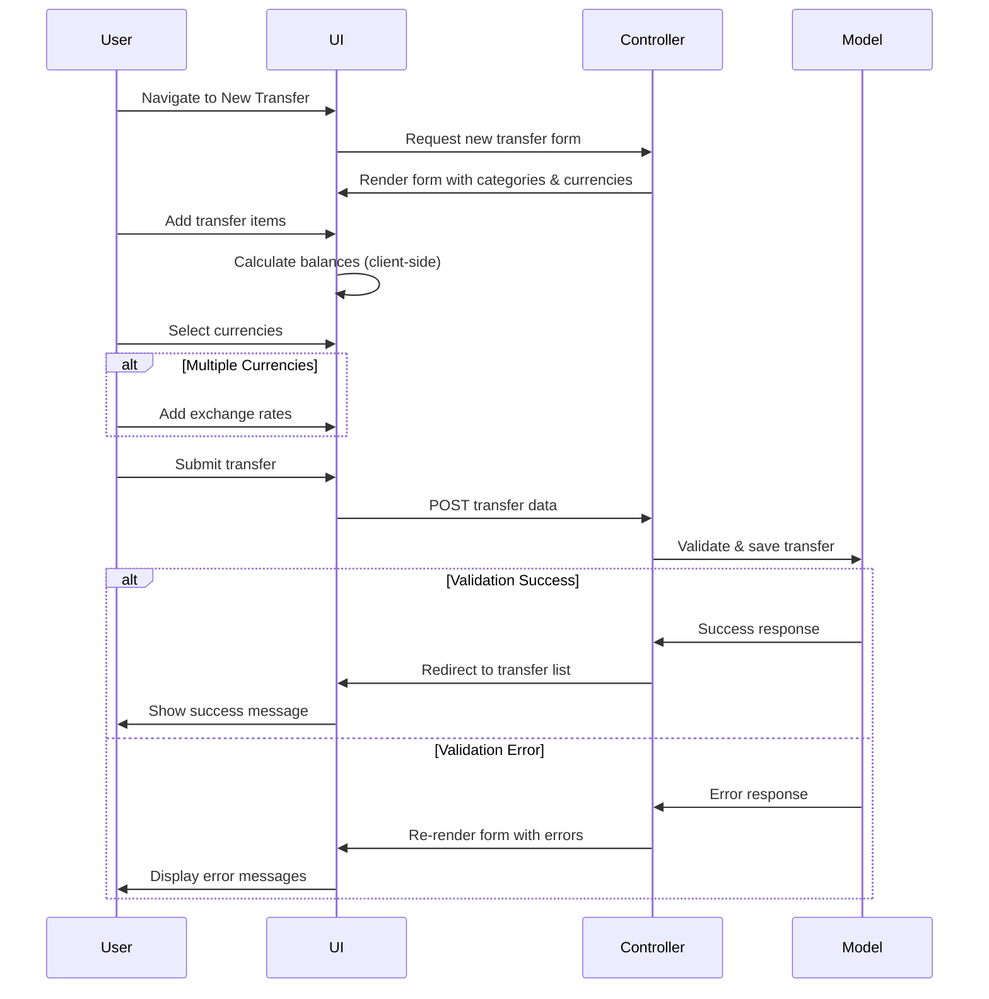
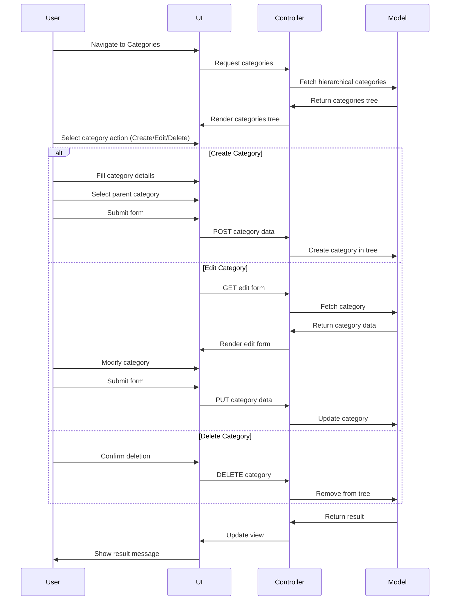

# Workflow Analysis

This document analyzes the key workflows in the Ruby on Rails application to provide insights for the reengineering effort to Angular and Node.js.

## Core Business Workflows

### 1. User Registration and Authentication

The application uses a custom authentication system with the following workflow:

1. User signs up with email, login, and password
2. System sends activation email
3. User activates account by clicking link
4. User can then log in with credentials
5. Authentication state is maintained via cookie token

**Key implementation notes:**
- Authentication is implemented through modules (`Authentication`, `AuthenticationByPassword`, `AuthenticationByCookieToken`)
- Password encryption uses SHA1 hashing with salt
- Session management is cookie-based

### 2. Financial Category Management

Categories are organized in a hierarchical tree structure using a nested set model:

1. User has predefined top-level categories created during registration (Assets, Income, Expenses, Loans, Opening Balances)
2. Categories can be nested to arbitrary depth
3. Each category has a specific type (ASSET, INCOME, EXPENSE, LOAN, BALANCE)
4. Categories are used for organizing financial data and reporting

**Key implementation notes:**
- Uses nested set model for efficient tree operations
- Each category has left and right boundaries for tree representation
- Categories are scoped to specific users

### 3. Transfer Management (Core Financial Transactions)

Transfers are the primary financial transactions in the system:

1. User creates a transfer with multiple transfer items
2. Each transfer item is associated with a category and currency
3. The system ensures that transfers are balanced (sum of all items equals zero)
4. For multi-currency transfers, appropriate exchange rates must be provided

**Key implementation notes:**
- A transfer consists of multiple transfer items
- Each transfer item represents money flowing into or out of a category
- Negative values represent outflows, positive represent inflows
- Multi-currency support requires currency conversion calculations

### 4. Currency and Exchange Rate Management

The application supports multiple currencies:

1. System provides default currencies
2. Users can add custom currencies
3. Exchange rates are defined between currency pairs
4. Exchange rates have effective dates

**Key implementation notes:**
- Currency pairs are always stored with lower ID first for consistency
- Exchange rates are bidirectional (left_to_right and right_to_left)
- Exchange rates can be time-based (with day attribute)

### 5. Financial Goal Management

Users can set financial goals to track progress:

1. User creates a goal associated with a category
2. Goals can be value-based (specific amount) or percentage-based
3. Goals have time periods (specific dates or predefined periods)
4. Goals can be cyclic (automatically recurring)
5. System tracks progress towards goals

**Key implementation notes:**
- Goals can be of two types: percentage-based or value-based
- Goals have completion conditions (at least / at most)
- Cyclic goals are grouped by cycle_group ID

### 6. Financial Reporting

The application provides various reporting options:

1. Share reports - show distribution of money across categories (pie charts)
2. Flow reports - show cash flow over time
3. Value reports - show value changes across categories
4. Reports can have different view types (pie, linear, text, bar)
5. Reports can cover custom time periods

**Key implementation notes:**
- Reports use single table inheritance (STI) pattern
- Report data is generated dynamically based on financial transactions
- Different report types have specialized calculation methods

## User Interface Workflows

### Transfer Creation UI Flow

### Category Management UI Flow

## API Integration Points

For reengineering to Angular and Node.js, the following API endpoints would need to be implemented:

1. **Authentication API**
   - Login
   - Registration
   - Account activation
   - Password reset

2. **Categories API**
   - CRUD operations
   - Tree structure operations
   - Category balance calculation

3. **Transfers API**
   - Create/Read/Update/Delete operations
   - Balance validation
   - Multi-currency support

4. **Currencies and Exchange API**
   - Currency management
   - Exchange rate management
   - Currency conversion

5. **Goals API**
   - Goal creation and tracking
   - Progress calculation
   - Cyclic goals management

6. **Reporting API**
   - Report generation
   - Report data retrieval
   - Different report types support

## Data Migration Considerations

When migrating from Rails to Angular/Node.js, consider:

1. **Database Schema**
   - The nested set model implementation might need adaptation
   - Currency exchange relationships need careful handling
   - User authentication data requires secure migration

2. **Business Logic**
   - Complex balance calculations
   - Multi-currency conversion logic
   - Reporting algorithms
   - Goal progress calculation

3. **UI State Management**
   - Form handling, especially for complex forms like transfers
   - Hierarchical data representation
   - Chart and reporting visualization