# Target State Architecture

## Overview

The target architecture consists of a decoupled frontend and backend, with Angular handling the presentation layer and Node.js providing API services. This architecture offers better scalability, maintainability, and separation of concerns compared to the monolithic Ruby on Rails application.

## Architecture Diagram

## Component Architecture

### Frontend Architecture

```mermaid
graph TD
    subgraph "Angular Application"
        App[App Module] --> Core[Core Module]
        App --> Feature1[Finance Module]
        App --> Feature2[Reports Module]
        App --> Feature3[Categories Module]
        App --> Feature4[Currency Module]
        App --> Feature5[Goals Module]
        App --> Shared[Shared Module]
        
        Core --> AuthService[Auth Service]
        Core --> HttpInterceptor[HTTP Interceptor]
        Core --> ErrorHandling[Error Handling]
        
        Shared --> Components[Common Components]
        Shared --> Pipes[Custom Pipes]
        Shared --> Directives[Directives]
    end
```

### Backend Architecture

## Technology Stack

### Frontend
- **Framework**: Angular (Latest LTS)
- **State Management**: NgRx Store
- **UI Component Library**: Angular Material
- **CSS Processing**: SCSS
- **HTTP Client**: Angular HttpClient
- **Testing**: Jasmine, Karma, Cypress (E2E)

### Backend
- **Framework**: Node.js with Express
- **ORM**: TypeORM or Sequelize
- **Database**: PostgreSQL
- **Authentication**: JWT (JSON Web Tokens)
- **API Documentation**: Swagger/OpenAPI
- **Testing**: Jest, Supertest
- **Validation**: Express Validator or Joi

### Development Tools
- **Package Manager**: npm or yarn
- **Build Tool**: Angular CLI, Webpack
- **Linting**: ESLint, Prettier
- **CI/CD**: GitHub Actions or Jenkins
- **Containerization**: Docker
- **Version Control**: Git

## Key Architectural Decisions

1. **RESTful API Design**: The backend will expose RESTful APIs that follow best practices for resource naming, HTTP methods, and status codes.

2. **JWT Authentication**: JSON Web Tokens will be used for authentication instead of session-based authentication.

3. **Hierarchical Component Structure**: Angular components will be organized in a hierarchy that mirrors the domain model.

4. **Responsive Design**: The application will be designed to work on desktop and mobile devices from the ground up.

5. **Lazy Loading**: Angular modules will be lazy-loaded to improve initial loading performance.

6. **Standardized Error Handling**: A consistent approach to error handling across the frontend and backend.

7. **Comprehensive Logging**: Structured logging at various levels for debugging and monitoring.

8. **Containerization**: Application components will be containerized for ease of deployment and scaling.

9. **Automated Testing**: Comprehensive unit, integration, and E2E tests will be implemented.

10. **Feature Flags**: A feature flag system will be implemented to control the rollout of new features.

## Security Considerations

1. **Authentication & Authorization**: JWT-based authentication with role-based access control.

2. **API Security**: 
   - Rate limiting to prevent abuse
   - Input validation on all endpoints
   - Security headers
   - CORS configuration

3. **Frontend Security**:
   - Protection against XSS attacks
   - CSRF protection
   - Secure cookie handling

4. **Data Protection**:
   - Encryption at rest and in transit
   - Data validation at all layers
   - Parameterized queries to prevent SQL injection

## Performance Considerations

1. **Database Optimization**:
   - Appropriate indexing
   - Query optimization
   - Connection pooling

2. **Frontend Optimization**:
   - Lazy loading of modules
   - Virtual scrolling for large lists
   - Component optimization
   - Asset optimization

3. **API Optimization**:
   - Response compression
   - Caching strategies
   - Pagination for large datasets
   - GraphQL consideration for reducing over-fetching

4. **Monitoring and Profiling**:
   - Performance metrics collection
   - Real-time monitoring
   - Alerting on performance degradation