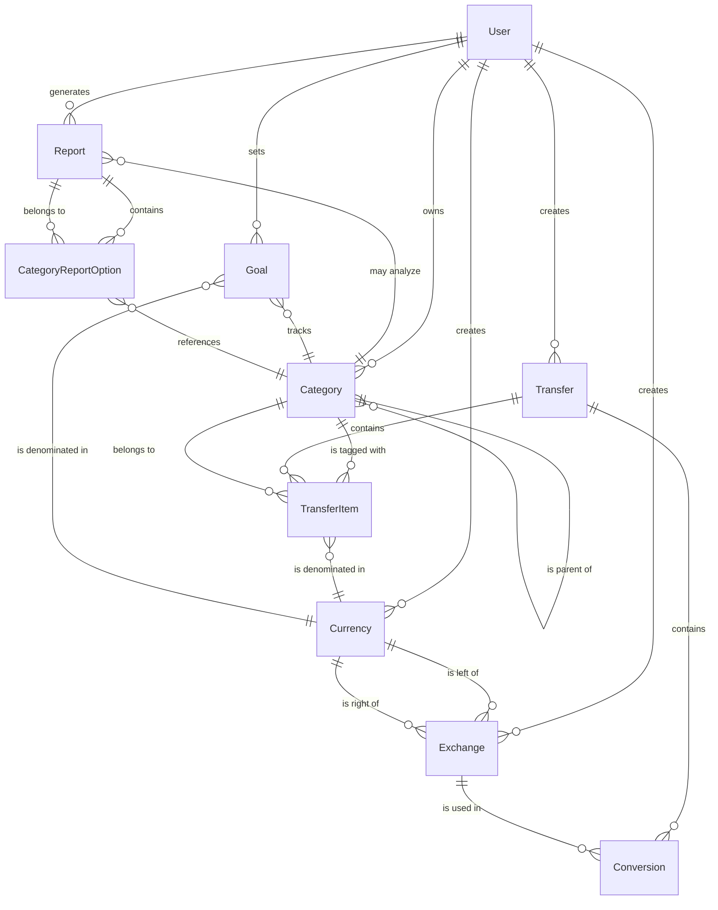

# Target State Data Model

This document outlines the data model for the target state Angular and Node.js application, which is based on the existing Ruby on Rails application's data model but with optimizations for a modern architecture.

## Entity Relationship Diagram



## Schema Definition

### TypeORM Entity Definitions

Below are the TypeORM entity definitions that will be used in the Node.js backend. These are based on the existing Ruby on Rails database schema but adapted for TypeORM with appropriate relationships.

#### User Entity

```typescript
@Entity()
export class User {
  @PrimaryGeneratedColumn()
  id: number;
  
  @Column({ length: 40, unique: true })
  login: string;
  
  @Column({ length: 100, default: '' })
  name: string;
  
  @Column({ length: 100 })
  email: string;
  
  @Column({ length: 60 })
  password: string; // Hashed password
  
  @CreateDateColumn()
  createdAt: Date;
  
  @UpdateDateColumn()
  updatedAt: Date;
  
  @Column({ default: 2 })
  transactionAmountLimitType: number;
  
  @Column({ nullable: true })
  transactionAmountLimitValue: number;
  
  @Column({ default: false })
  includeTransactionsFromSubcategories: boolean;
  
  @Column({ default: 0 })
  multiCurrencyBalanceCalculatingAlgorithm: number;
  
  @Column({ default: 1 })
  defaultCurrencyId: number;
  
  @Column({ default: true })
  invertSaldoForIncome: boolean;
  
  @OneToMany(() => Category, category => category.user)
  categories: Category[];
  
  @OneToMany(() => Transfer, transfer => transfer.user)
  transfers: Transfer[];
  
  @OneToMany(() => Goal, goal => goal.user)
  goals: Goal[];
  
  @OneToMany(() => Report, report => report.user)
  reports: Report[];
  
  @OneToMany(() => Currency, currency => currency.user)
  currencies: Currency[];
  
  @OneToMany(() => Exchange, exchange => exchange.user)
  exchanges: Exchange[];
}
```

#### Category Entity

```typescript
@Entity()
export class Category {
  @PrimaryGeneratedColumn()
  id: number;
  
  @Column()
  name: string;
  
  @Column({ nullable: true })
  description: string;
  
  @Column()
  categoryTypeInt: number;
  
  @ManyToOne(() => User, user => user.categories)
  user: User;
  
  @Column({ nullable: true })
  parentId: number;
  
  @Column({ nullable: true })
  lft: number;
  
  @Column({ nullable: true })
  rgt: number;
  
  @ManyToOne(() => Category, category => category.children)
  parent: Category;
  
  @OneToMany(() => Category, category => category.parent)
  children: Category[];
  
  @OneToMany(() => TransferItem, transferItem => transferItem.category)
  transferItems: TransferItem[];
  
  @OneToMany(() => Goal, goal => goal.category)
  goals: Goal[];
  
  @OneToMany(() => CategoryReportOption, option => option.category)
  reportOptions: CategoryReportOption[];
}
```

#### Transfer Entity

```typescript
@Entity()
export class Transfer {
  @PrimaryGeneratedColumn()
  id: number;
  
  @Column('text')
  description: string;
  
  @Column('date')
  day: Date;
  
  @ManyToOne(() => User, user => user.transfers)
  user: User;
  
  @Column({ nullable: true })
  importGuid: string;
  
  @OneToMany(() => TransferItem, transferItem => transferItem.transfer, { cascade: true })
  transferItems: TransferItem[];
  
  @OneToMany(() => Conversion, conversion => conversion.transfer, { cascade: true })
  conversions: Conversion[];
}
```

#### TransferItem Entity

```typescript
@Entity()
export class TransferItem {
  @PrimaryGeneratedColumn()
  id: number;
  
  @Column('decimal', { precision: 10, scale: 2 })
  value: number;
  
  @Column('text', { nullable: true })
  description: string;
  
  @ManyToOne(() => Transfer, transfer => transfer.transferItems)
  transfer: Transfer;
  
  @ManyToOne(() => Category, category => category.transferItems)
  category: Category;
  
  @ManyToOne(() => Currency, currency => currency.transferItems)
  currency: Currency;
}
```

#### Currency Entity

```typescript
@Entity()
export class Currency {
  @PrimaryGeneratedColumn()
  id: number;
  
  @Column()
  symbol: string;
  
  @Column()
  longSymbol: string;
  
  @Column()
  name: string;
  
  @Column()
  longName: string;
  
  @ManyToOne(() => User, user => user.currencies, { nullable: true })
  user: User;
  
  @OneToMany(() => TransferItem, transferItem => transferItem.currency)
  transferItems: TransferItem[];
  
  @OneToMany(() => Goal, goal => goal.currency)
  goals: Goal[];
  
  @OneToMany(() => Exchange, exchange => exchange.leftCurrency)
  leftExchanges: Exchange[];
  
  @OneToMany(() => Exchange, exchange => exchange.rightCurrency)
  rightExchanges: Exchange[];
}
```

#### Exchange Entity

```typescript
@Entity()
export class Exchange {
  @PrimaryGeneratedColumn()
  id: number;
  
  @Column('decimal', { precision: 10, scale: 6 })
  leftToRight: number;
  
  @Column('decimal', { precision: 10, scale: 6 })
  rightToLeft: number;
  
  @Column('date')
  day: Date;
  
  @Column('text', { nullable: true })
  description: string;
  
  @ManyToOne(() => User, user => user.exchanges)
  user: User;
  
  @ManyToOne(() => Currency, currency => currency.leftExchanges)
  leftCurrency: Currency;
  
  @ManyToOne(() => Currency, currency => currency.rightExchanges)
  rightCurrency: Currency;
  
  @OneToMany(() => Conversion, conversion => conversion.exchange)
  conversions: Conversion[];
}
```

#### Conversion Entity

```typescript
@Entity()
export class Conversion {
  @PrimaryGeneratedColumn()
  id: number;
  
  @ManyToOne(() => Transfer, transfer => transfer.conversions)
  transfer: Transfer;
  
  @ManyToOne(() => Exchange, exchange => exchange.conversions)
  exchange: Exchange;
}
```

#### Goal Entity

```typescript
@Entity()
export class Goal {
  @PrimaryGeneratedColumn()
  id: number;
  
  @Column()
  name: string;
  
  @Column('decimal', { precision: 10, scale: 2 })
  value: number;
  
  @Column({ nullable: true })
  description: string;
  
  @Column('date', { nullable: true })
  deadline: Date;
  
  @ManyToOne(() => User, user => user.goals)
  user: User;
  
  @ManyToOne(() => Category, category => category.goals)
  category: Category;
  
  @ManyToOne(() => Currency, currency => currency.goals)
  currency: Currency;
}
```

#### Report Entity

```typescript
@Entity()
@TableInheritance({ column: { type: "varchar", name: "type" } })
export class Report {
  @PrimaryGeneratedColumn()
  id: number;
  
  @Column()
  type: string;
  
  @Column()
  name: string;
  
  @Column()
  periodTypeInt: number;
  
  @Column('date', { nullable: true })
  periodStart: Date;
  
  @Column('date', { nullable: true })
  periodEnd: Date;
  
  @Column()
  reportViewTypeInt: number;
  
  @ManyToOne(() => User, user => user.reports)
  user: User;
  
  @CreateDateColumn()
  createdAt: Date;
  
  @UpdateDateColumn()
  updatedAt: Date;
  
  @Column({ default: 0 })
  depth: number;
  
  @Column({ default: 0 })
  maxCategoriesValuesCount: number;
  
  @ManyToOne(() => Category, { nullable: true })
  category: Category;
  
  @Column({ default: 5 })
  periodDivisionInt: number;
  
  @Column({ default: false })
  temporary: boolean;
  
  @Column({ default: false })
  relativePeriod: boolean;
  
  @OneToMany(() => CategoryReportOption, option => option.report)
  categoryReportOptions: CategoryReportOption[];
}

@ChildEntity()
export class ShareReport extends Report {
  // Additional fields specific to ShareReport
}

@ChildEntity()
export class FlowReport extends Report {
  // Additional fields specific to FlowReport
}

@ChildEntity()
export class ValueReport extends Report {
  // Additional fields specific to ValueReport
}
```

#### CategoryReportOption Entity

```typescript
@Entity()
export class CategoryReportOption {
  @PrimaryGeneratedColumn()
  id: number;
  
  @ManyToOne(() => Report, report => report.categoryReportOptions)
  report: Report;
  
  @ManyToOne(() => Category, category => category.reportOptions)
  category: Category;
  
  @Column()
  inclusionType: string; // e.g., 'category_only', 'category_and_subcategories'
}
```

## Data Dictionary

### User
| Field | Type | Description |
|-------|------|-------------|
| id | number | Primary key |
| login | string | Unique username for authentication |
| name | string | Display name of the user |
| email | string | Email address for contact and notifications |
| password | string | Hashed password for authentication |
| createdAt | Date | Timestamp when user was created |
| updatedAt | Date | Timestamp when user was last updated |
| transactionAmountLimitType | number | Type of limit for shown transactions (enum value) |
| transactionAmountLimitValue | number | Value for the transaction limit |
| includeTransactionsFromSubcategories | boolean | Whether to include subcategories in calculations |
| multiCurrencyBalanceCalculatingAlgorithm | number | Algorithm used for multi-currency calculations |
| defaultCurrencyId | number | Default currency for the user |
| invertSaldoForIncome | boolean | Whether to invert balance for income categories |

### Category
| Field | Type | Description |
|-------|------|-------------|
| id | number | Primary key |
| name | string | Category name |
| description | string | Category description |
| categoryTypeInt | number | Type of category (enum: income, expense, asset, etc.) |
| userId | number | Foreign key to User |
| parentId | number | Self-reference for hierarchical categories |
| lft | number | Left value for nested set model |
| rgt | number | Right value for nested set model |

### Transfer
| Field | Type | Description |
|-------|------|-------------|
| id | number | Primary key |
| description | string | Description of the transfer |
| day | Date | Date when the transfer occurred |
| userId | number | Foreign key to User |
| importGuid | string | Unique identifier for imported transfers |

### TransferItem
| Field | Type | Description |
|-------|------|-------------|
| id | number | Primary key |
| value | number | Monetary value of the item |
| description | string | Description of the transfer item |
| transferId | number | Foreign key to Transfer |
| categoryId | number | Foreign key to Category |
| currencyId | number | Foreign key to Currency |

### Currency
| Field | Type | Description |
|-------|------|-------------|
| id | number | Primary key |
| symbol | string | Short symbol of the currency (e.g., "$") |
| longSymbol | string | ISO code of the currency (e.g., "USD") |
| name | string | Short name of the currency |
| longName | string | Full name of the currency |
| userId | number | Foreign key to User (null for system currencies) |

### Exchange
| Field | Type | Description |
|-------|------|-------------|
| id | number | Primary key |
| leftToRight | number | Exchange rate from left to right currency |
| rightToLeft | number | Exchange rate from right to left currency |
| day | Date | Date of the exchange rate |
| description | string | Description or source of the exchange rate |
| userId | number | Foreign key to User |
| leftCurrencyId | number | Foreign key to Currency (left side) |
| rightCurrencyId | number | Foreign key to Currency (right side) |

### Conversion
| Field | Type | Description |
|-------|------|-------------|
| id | number | Primary key |
| transferId | number | Foreign key to Transfer |
| exchangeId | number | Foreign key to Exchange |

### Goal
| Field | Type | Description |
|-------|------|-------------|
| id | number | Primary key |
| name | string | Name of the financial goal |
| value | number | Target value for the goal |
| description | string | Description of the goal |
| deadline | Date | Target date to reach the goal |
| userId | number | Foreign key to User |
| categoryId | number | Foreign key to Category |
| currencyId | number | Foreign key to Currency |

### Report
| Field | Type | Description |
|-------|------|-------------|
| id | number | Primary key |
| type | string | Discriminator for report type |
| name | string | Name of the report |
| periodTypeInt | number | Type of period (enum: THIS_MONTH, LAST_MONTH, etc.) |
| periodStart | Date | Start date for the report period |
| periodEnd | Date | End date for the report period |
| reportViewTypeInt | number | Type of visualization (pie, linear, text, bar) |
| userId | number | Foreign key to User |
| createdAt | Date | Timestamp when report was created |
| updatedAt | Date | Timestamp when report was last updated |
| depth | number | Depth of categories to include in report |
| maxCategoriesValuesCount | number | Maximum number of categories to show |
| categoryId | number | Foreign key to Category (for ShareReport) |
| periodDivisionInt | number | How to divide the period (day, week, month, etc.) |
| temporary | boolean | Whether the report is temporary |
| relativePeriod | boolean | Whether the period is relative to current date |

### CategoryReportOption
| Field | Type | Description |
|-------|------|-------------|
| id | number | Primary key |
| reportId | number | Foreign key to Report |
| categoryId | number | Foreign key to Category |
| inclusionType | string | How to include the category (only, with subcategories) |

## Enumerations

### CategoryType
- INCOME
- EXPENSE
- ASSET

### PeriodType
- SELECTED
- THIS_WEEK
- LAST_WEEK
- THIS_MONTH
- LAST_MONTH
- THIS_YEAR
- LAST_YEAR

### ReportViewType
- PIE
- LINEAR
- TEXT
- BAR

### PeriodDivision
- DAY
- WEEK
- MONTH
- QUARTER
- YEAR

### TransactionAmountLimitType
- TRANSACTION_COUNT
- WEEK_COUNT
- THIS_MONTH
- THIS_AND_LAST_MONTH

## Indexes

To optimize query performance, the following indexes will be created:

1. **User Table**
   - `login` (unique)
   - `email` (unique)

2. **Transfer Table**
   - Composite index on `userId` and `day`
   - Index on `day`

3. **TransferItem Table**
   - Composite index on `transferId`, `categoryId`
   - Index on `currencyId`

4. **Category Table**
   - Composite index on `userId`, `lft`, `rgt`
   - Index on `parentId`

5. **Exchange Table**
   - Composite index on `leftCurrencyId`, `rightCurrencyId`, `day`
   - Index on `day`

6. **Goal Table**
   - Composite index on `userId`, `categoryId`
   - Index on `deadline`

7. **Report Table**
   - Composite index on `userId`, `type`
   - Index on `periodStart`, `periodEnd`

## Data Migration Strategy

The migration of data from the Ruby on Rails application to the new Angular and Node.js application will involve:

1. **Schema Migration**: Create the new database schema using TypeORM migrations.
2. **Data Export**: Export data from the Rails application using a custom script.
3. **Data Transformation**: Transform the exported data to match the new schema if needed.
4. **Data Import**: Import the transformed data into the new database.
5. **Validation**: Verify the integrity of the migrated data.
6. **Synchronization Plan**: If both systems need to run in parallel, implement a synchronization mechanism.

## Data Validation Rules

1. **User**:
   - Email must be valid format
   - Password must meet security requirements
   - Login must be unique

2. **Category**:
   - Name cannot be empty
   - Nested set values must be valid (lft < rgt)
   - Category type must be valid enum

3. **Transfer**:
   - Must have at least two transfer items
   - Sum of values must be zero
   - Day must be a valid date

4. **TransferItem**:
   - Must belong to a valid transfer
   - Must have a valid category
   - Must have a value

5. **Currency**:
   - Long symbol must be 3 uppercase letters
   - Symbol and name must be unique within user's currencies

6. **Exchange**:
   - Left and right currencies must be different
   - Rates must be positive
   - Day must be a valid date

7. **Goal**:
   - Name cannot be empty
   - Value must be positive
   - If deadline exists, must be a future date

8. **Report**:
   - Name cannot be empty
   - If not relative period, must have start and end dates
   - End date must be after start date