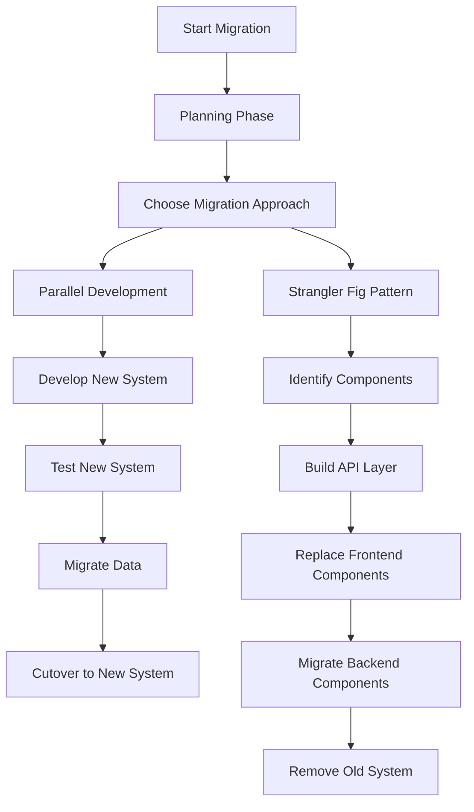
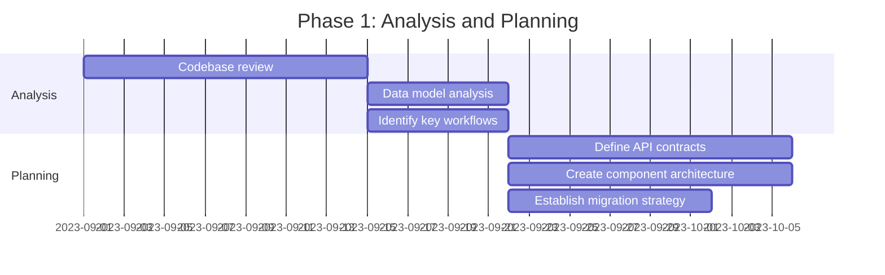
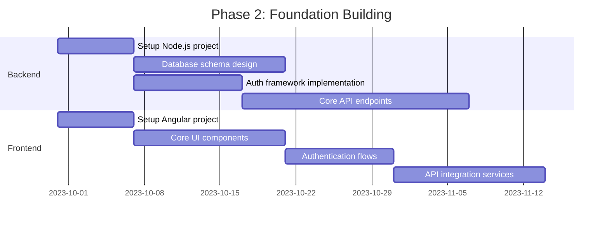
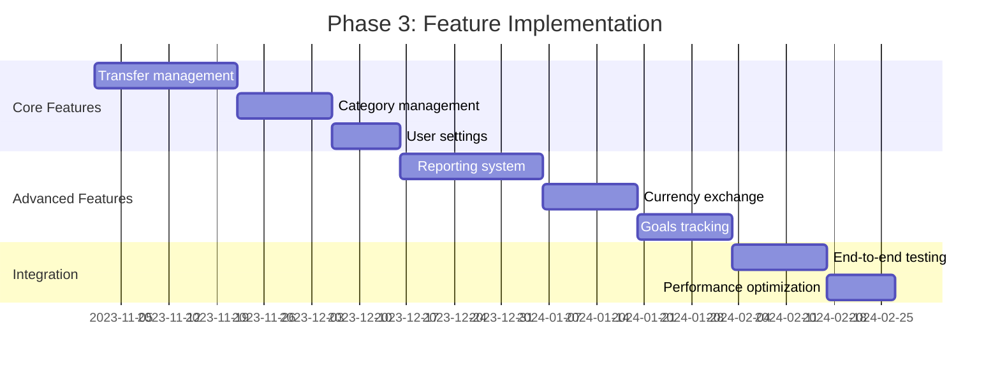
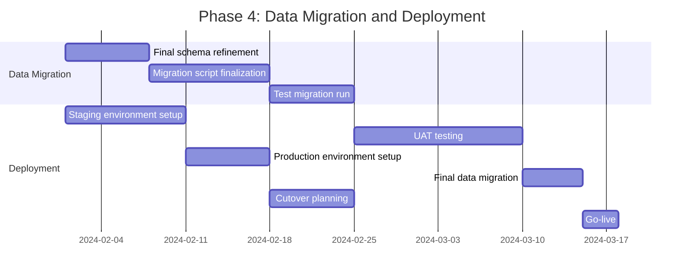
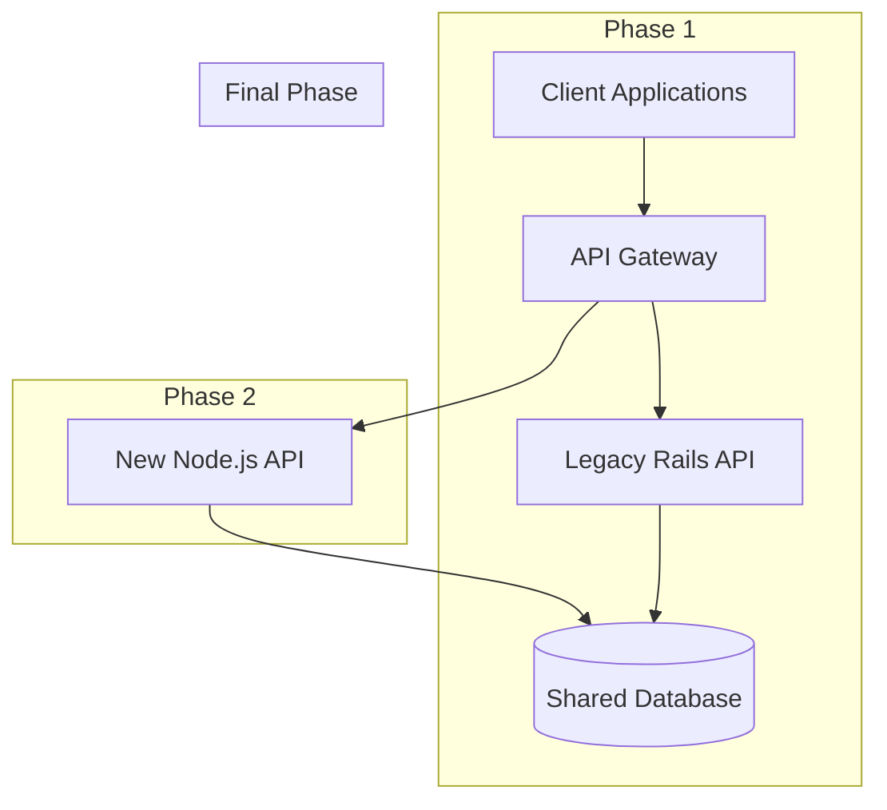
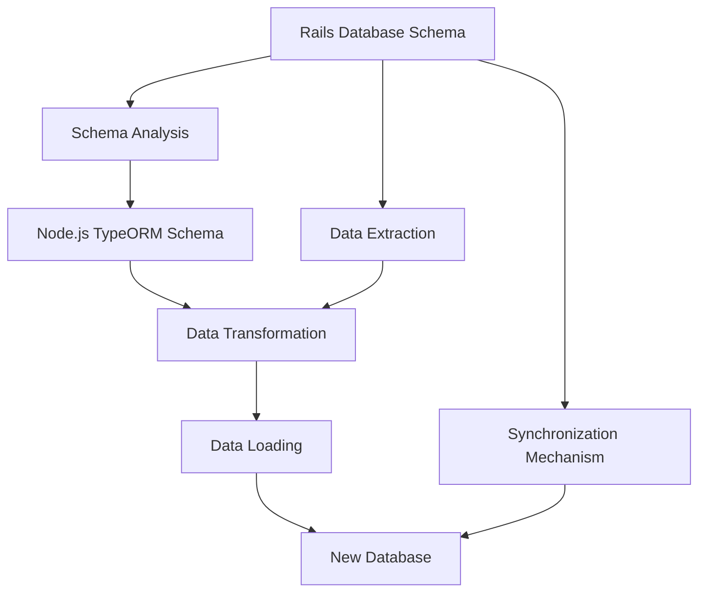
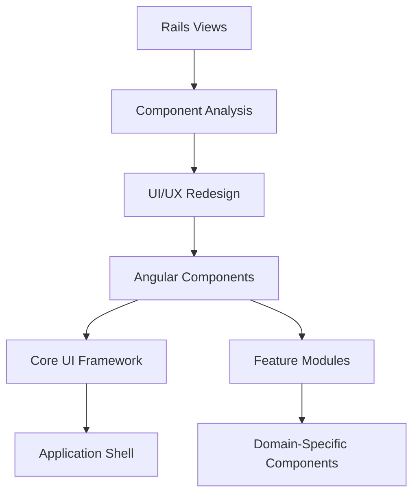
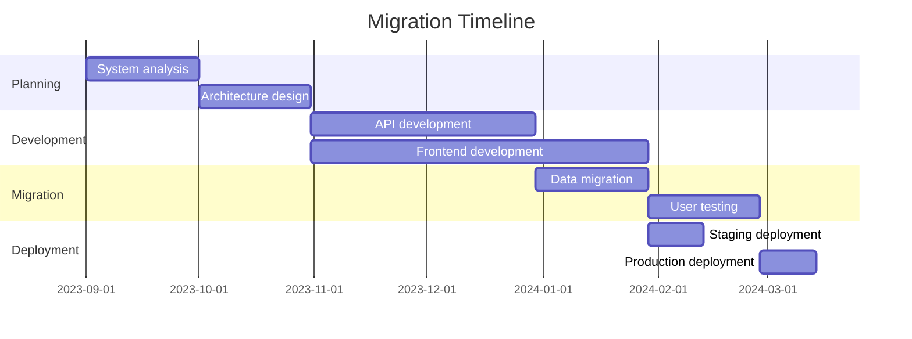

# Migration Strategy

This document outlines the strategic approach for migrating from the current Ruby on Rails application to the target Angular and Node.js architecture.

## Migration Overview

The migration from the Ruby on Rails monolith to an Angular frontend with a Node.js REST API backend requires careful planning to ensure a smooth transition with minimal disruption to users. This document outlines the strategy, approach, and key considerations for this migration.

## Migration Approaches

We will use a phased migration approach combining the following strategies:

### Phase 1: Analysis and Planning

1. **Current System Assessment**
   - Conduct comprehensive analysis of existing codebase
   - Document business rules and domain logic
   - Identify complex areas requiring special attention
   - Map all existing data flows and integrations

2. **Technical Stack Evaluation**
   - Confirm technology choices (Angular, Node.js, TypeORM)
   - Identify required libraries and dependencies
   - Assess team skills and training needs
   - Set up development environment and tooling

3. **Migration Strategy Definition**
   - Define phased approach with clear milestones
   - Establish success criteria for each phase
   - Create risk assessment and mitigation plans
   - Plan for parallel operation during transition

### Phase 2: Foundation Building

1. **API Development**
   - Design RESTful API following best practices
   - Implement authentication and authorization
   - Create core endpoints for essential data access
   - Develop comprehensive test suite for API

2. **Database Migration Planning**
   - Design target database schema
   - Create data migration scripts
   - Test data migration with sample data
   - Plan for data integrity verification

3. **Frontend Scaffolding**
   - Set up Angular project structure
   - Implement authentication flows
   - Create shared components and services
   - Establish state management patterns

### Phase 3: Feature Implementation

1. **Core Features Implementation**
   - Implement user management features
   - Build transfer/transaction functionality
   - Develop category management system
   - Create basic reporting capabilities

2. **Advanced Features Implementation**
   - Implement advanced reporting
   - Build goal tracking system
   - Develop currency exchange functionality
   - Create data import/export features

3. **Integration and Testing**
   - Conduct end-to-end testing
   - Perform integration testing
   - Execute performance testing and optimization
   - Complete security review and testing

### Phase 4: Data Migration and Deployment

1. **Final Data Migration**
   - Perform comprehensive data validation
   - Execute final data migration scripts
   - Verify data integrity and consistency
   - Create data rollback plan

2. **User Acceptance Testing**
   - Conduct user training
   - Perform UAT with key stakeholders
   - Gather and address feedback
   - Refine user interface based on feedback

3. **Deployment and Go-Live**
   - Set up production environment
   - Implement monitoring and logging
   - Execute cutover plan
   - Provide post-launch support

## Technical Approach Details

### API Layer Strategy

The API layer will be the bridge between the old and new systems, enabling gradual migration:

1. **API First Development**
   - Design comprehensive API contract before implementation
   - Use OpenAPI/Swagger for documentation and code generation
   - Implement API versioning from the start
   - Create API tests before implementing endpoints

2. **Authentication Migration**
   - Implement JWT-based authentication in the new system
   - Create auth bridge between old and new systems during transition
   - Migrate user credentials securely with proper hashing

3. **Progressive API Replacement**
   - Replace API endpoints one domain at a time
   - Start with read-only endpoints, then add write operations
   - Use feature flags to control which system handles each endpoint
   - Monitor performance and errors closely during transition

### Database Migration

The database migration will follow these steps:

1. **Schema Migration**
   - Map Rails ActiveRecord models to TypeORM entities
   - Handle complex relationships and inheritance
   - Implement appropriate indexes and constraints
   - Consider performance optimizations in new schema

2. **Data Migration Tools**
   - Develop custom ETL scripts for data migration
   - Handle data transformations and normalization
   - Implement validation and error handling
   - Create rollback capabilities

3. **Data Synchronization During Transition**
   - Implement bidirectional sync during parallel operation
   - Use database triggers or change data capture
   - Create conflict resolution mechanisms
   - Monitor synchronization performance and fix issues

### Frontend Migration

The frontend migration will follow this approach:

1. **Component-Based Migration**
   - Break UI into discrete components with clear responsibilities
   - Map Rails views to Angular components
   - Improve UX during redesign process
   - Create component library for consistency

2. **State Management**
   - Implement NgRx for global state management
   - Define clear state models and selectors
   - Create effects for handling side effects
   - Implement robust error handling

3. **Progressive Enhancement**
   - Start with core user flows
   - Add features incrementally
   - Ensure responsive design for all screen sizes
   - Implement accessibility features throughout

## Risk Management

### Potential Risks and Mitigation Strategies

| Risk | Probability | Impact | Mitigation Strategy |
|------|------------|--------|-------------------|
| Data loss during migration | Low | High | Multiple test runs, comprehensive backups, thorough validation |
| Performance issues in new system | Medium | High | Performance testing early, optimization, scalable architecture |
| User adaptation challenges | Medium | Medium | Comprehensive training, familiar UI patterns, phased rollout |
| Integration issues with third-party systems | Medium | Medium | Early integration testing, fallback mechanisms |
| Timeline delays | High | Medium | Buffer in schedule, prioritized features, MVP approach |
| Technical debt from rushed implementation | Medium | High | Strong code review process, automated testing, clear standards |

### Rollback Strategy

In case of critical issues post-migration:

1. **Partial Rollback**
   - Ability to route traffic back to the old system for specific features
   - Keep old system running until new system is stable
   - Implement feature flags to disable problematic areas

2. **Complete Rollback**
   - Maintain complete backup of original system and data
   - Document detailed rollback procedures
   - Test rollback process before actual migration
   - Create communication plan for users in case of rollback

3. **Data Recovery**
   - Implement point-in-time recovery capabilities
   - Maintain transaction logs during migration
   - Create data reconciliation tools

## Success Criteria

The migration will be considered successful when:

1. **Functional Completeness**
   - All features from the original system are implemented
   - New features planned for the target system are working
   - No critical functionality is missing

2. **Technical Success**
   - System meets performance benchmarks
   - Code quality metrics meet or exceed standards
   - Test coverage meets target thresholds

3. **User Acceptance**
   - User satisfaction metrics meet targets
   - Training is completed successfully
   - Support tickets related to migration are within acceptable limits

4. **Business Impact**
   - No significant disruption to business operations
   - Maintenance costs are reduced
   - New feature development velocity increases

## Timeline and Resource Allocation

### High-Level Timeline

### Resource Requirements

1. **Development Team**
   - Frontend developers (Angular expertise)
   - Backend developers (Node.js expertise)
   - Database specialists (PostgreSQL, data migration)
   - DevOps engineers (deployment, CI/CD)

2. **Infrastructure**
   - Development environments
   - Staging environment
   - Production environment
   - CI/CD pipeline
   - Monitoring and logging systems

3. **Support Resources**
   - User training materials
   - Documentation
   - Support staff during transition
   - Testing resources

## Tooling and Infrastructure

### Development Tools

- **Version Control**: Git with GitHub/GitLab
- **Project Management**: Jira or similar
- **CI/CD**: GitHub Actions or Jenkins
- **Testing**: Jest, Cypress, Postman
- **Documentation**: OpenAPI/Swagger, Compodoc

### Infrastructure

- **Hosting**: Cloud-based (AWS, Azure, or GCP)
- **Containerization**: Docker with Kubernetes
- **Database**: PostgreSQL
- **Caching**: Redis
- **Monitoring**: ELK Stack, Prometheus and Grafana

## Post-Migration Activities

1. **Performance Tuning**
   - Identify and resolve performance bottlenecks
   - Optimize database queries
   - Implement caching where beneficial
   - Fine-tune API responses

2. **Feature Enhancement**
   - Implement new features not possible in old architecture
   - Improve user experience based on feedback
   - Extend API capabilities for future integrations

3. **Documentation and Knowledge Transfer**
   - Complete system documentation
   - Conduct knowledge transfer sessions
   - Create maintenance runbooks
   - Document lessons learned

## Conclusion

This migration strategy provides a comprehensive plan for transitioning from the Ruby on Rails application to an Angular and Node.js architecture. By following this phased approach with careful planning and risk management, the migration can be executed with minimal disruption while setting up the application for future growth and enhancement.