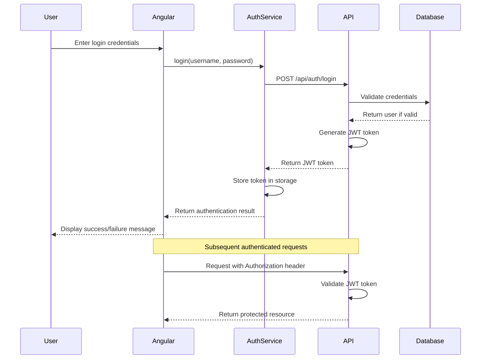
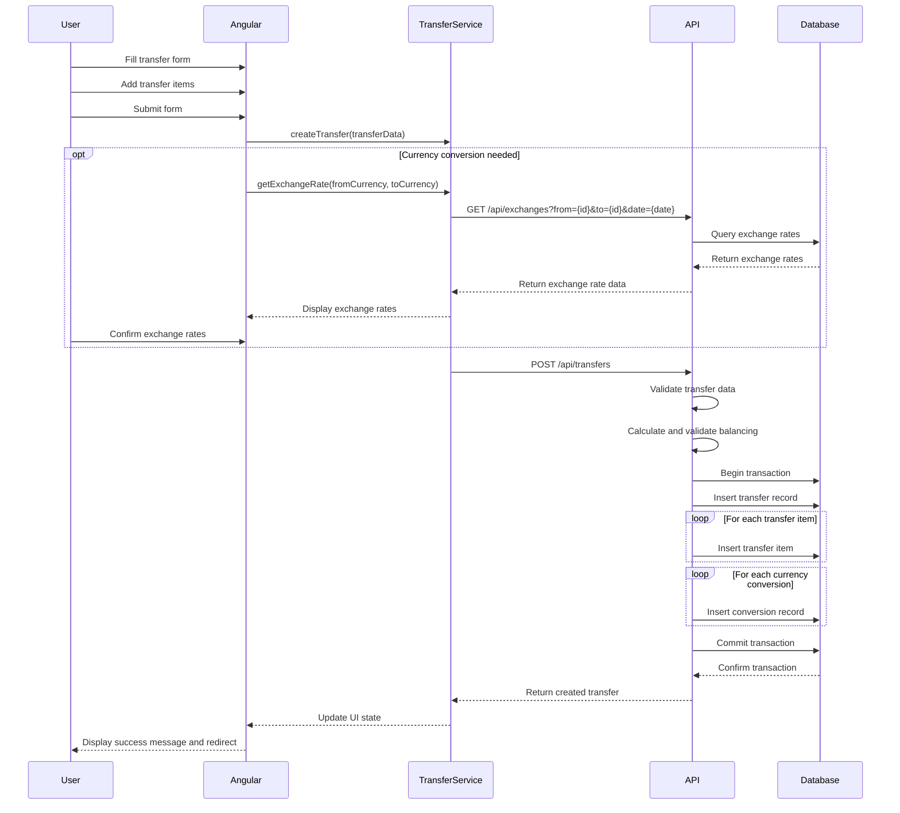
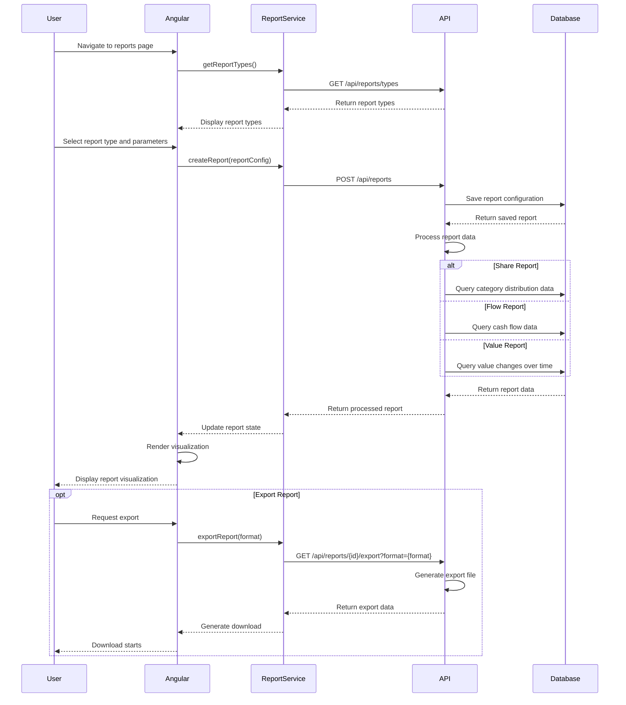
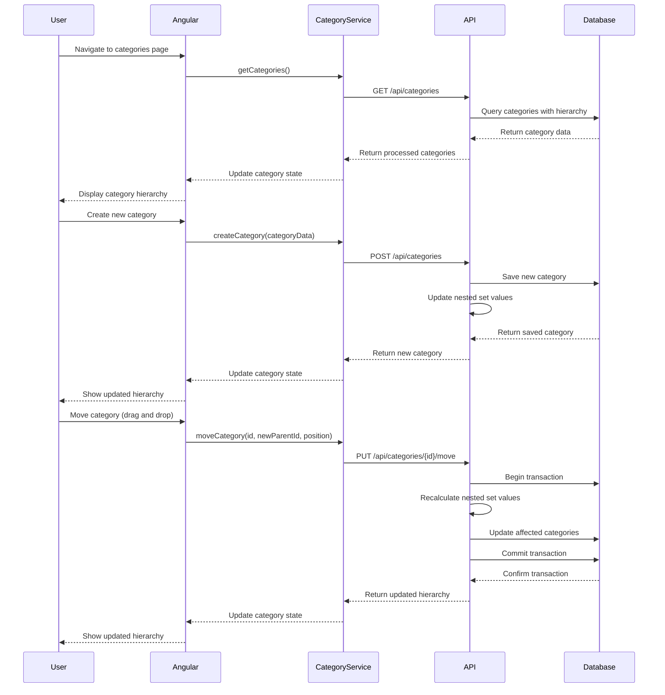
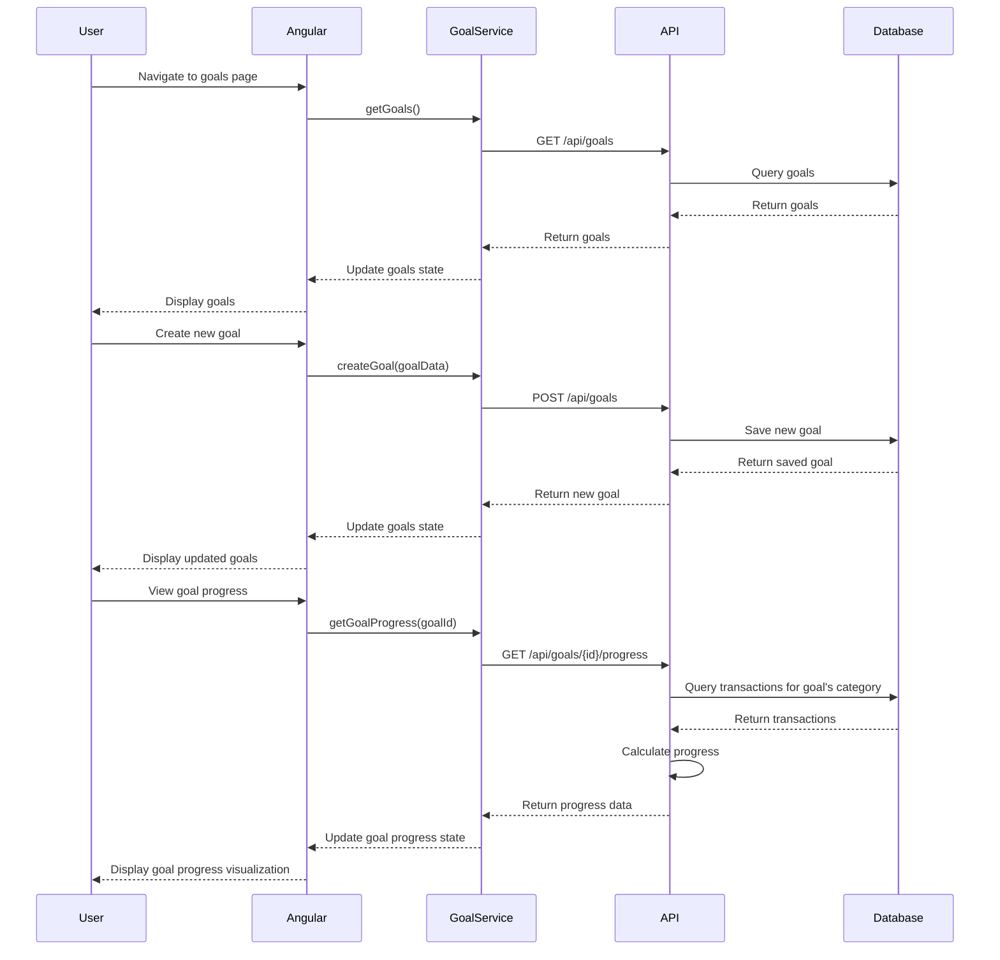
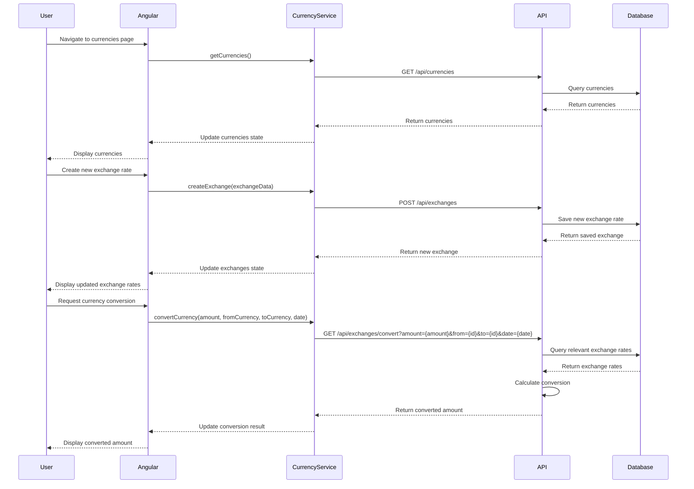
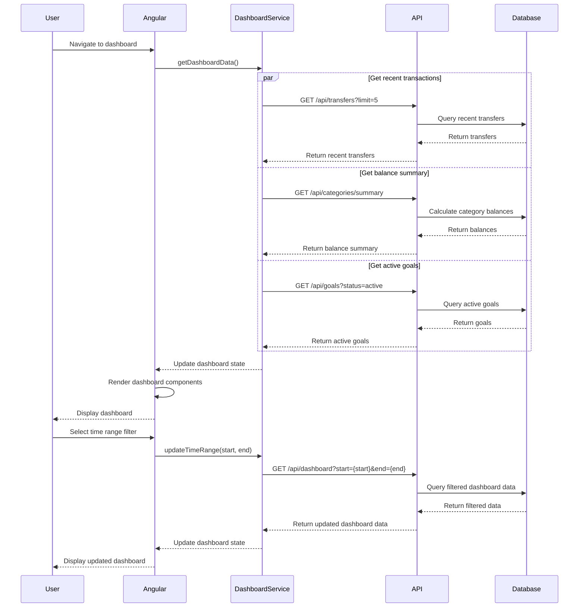
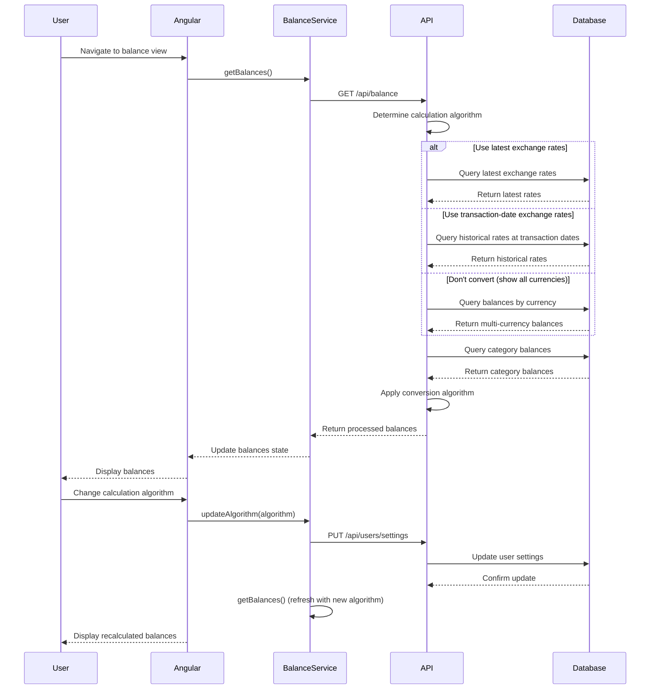

# Target State Sequence Diagrams

This document contains key sequence diagrams showing how the Angular frontend will interact with the Node.js backend in the target architecture.

## User Authentication Sequence

## Transfer Creation Sequence

## Report Generation Sequence

## Category Management Sequence

## Goal Tracking Sequence

## Currency Exchange Management Sequence

## Financial Dashboard Sequence

## Multi-Currency Balance Calculation Sequence

