# UI Component Structure

This document outlines the Angular component structure and organization for the target state application.

## Component Organization

The application UI is organized into modules following Angular best practices, with feature modules containing domain-specific components and shared modules for reusable components.

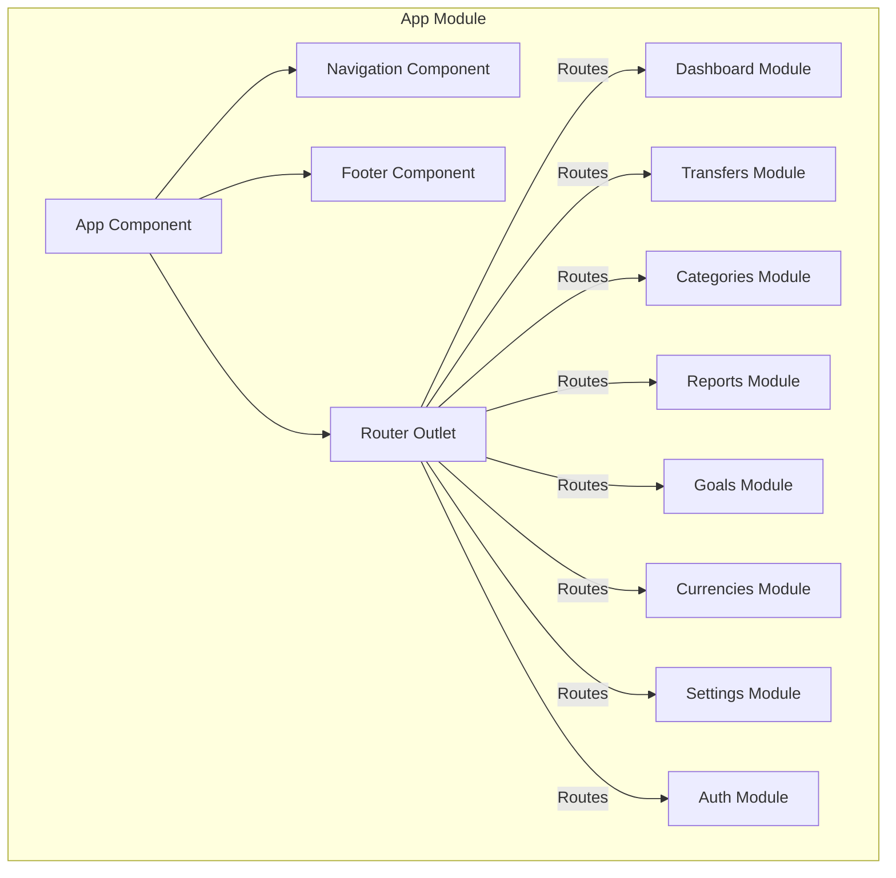

## Feature Modules

### Dashboard Module

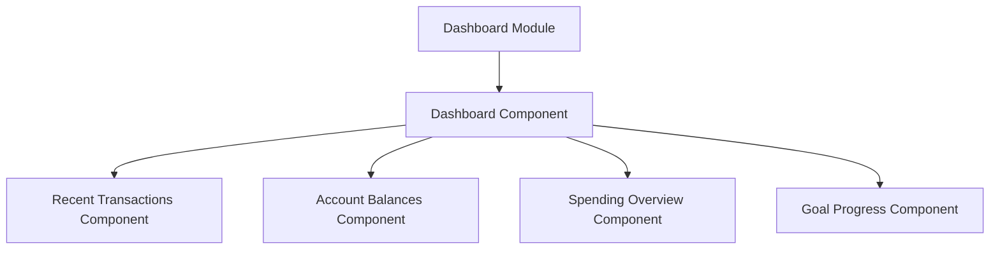

### Transfers Module

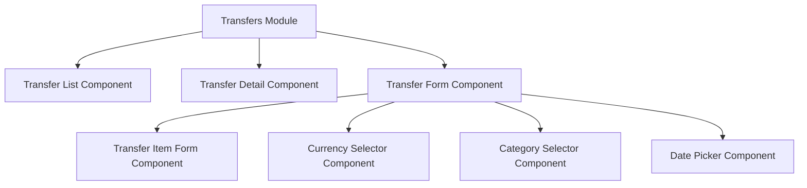

### Categories Module

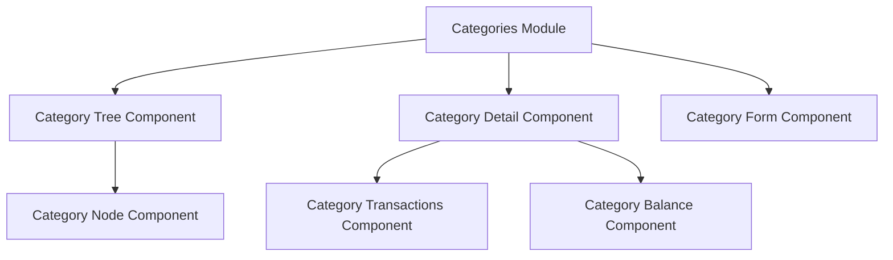

### Reports Module

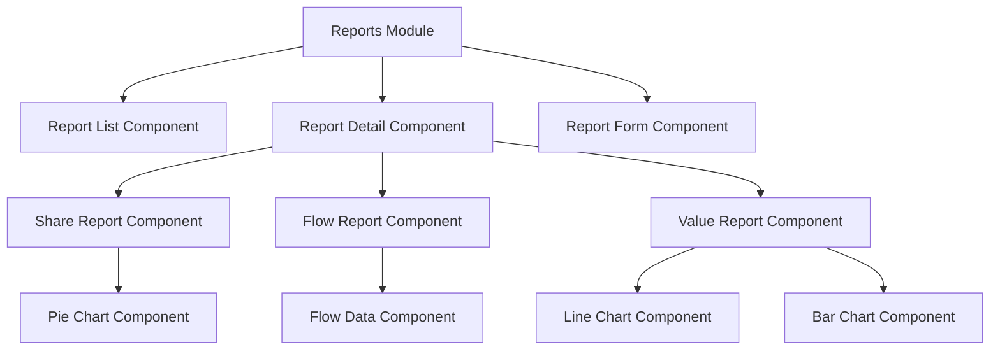

### Goals Module

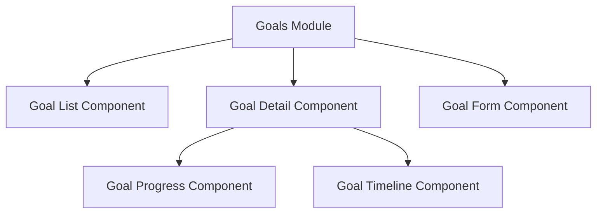

### Currencies Module

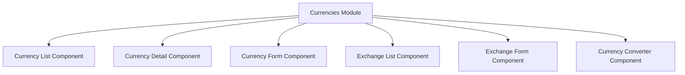

### Settings Module

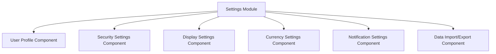

### Auth Module

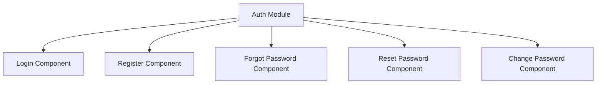

## Shared Components

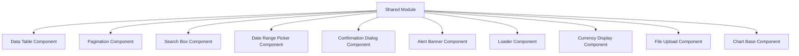

## Core Module

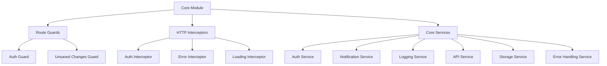

## UI Screens and Components

### Dashboard Screen

The dashboard provides an overview of financial status and recent activities:

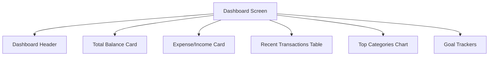

### Transfer List Screen

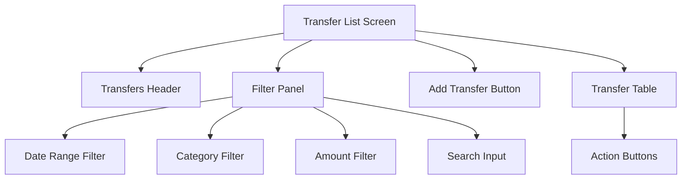

### Transfer Form Screen

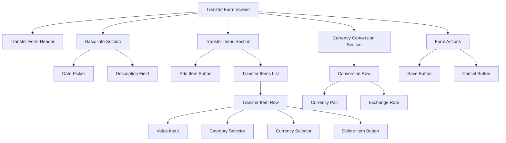

### Categories Screen

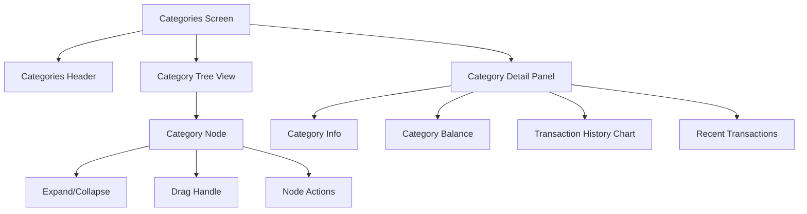

### Reports Screen

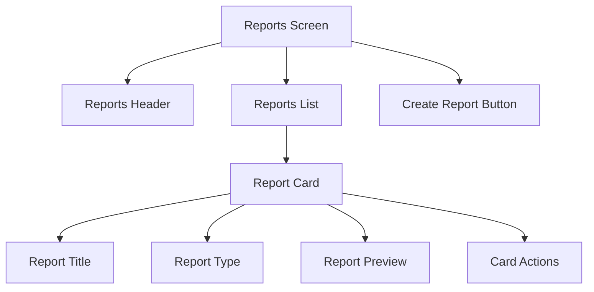

### Report Detail Screen

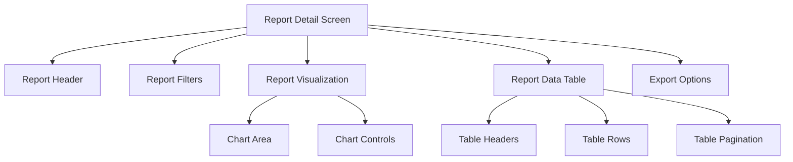

### Goals Screen

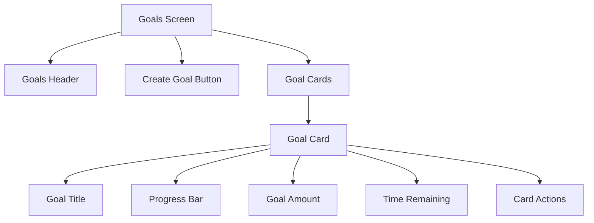

### Currency Management Screen

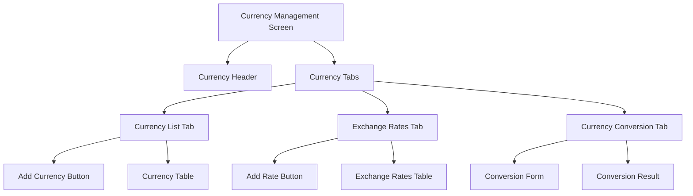

## Component Design Guidelines

### Component Communication Patterns

1. **Parent-Child Communication**
   - Inputs (`@Input()`) for passing data from parent to child
   - Outputs (`@Output()`) for events from child to parent

2. **Service-based Communication**
   - Shared services for components that need to communicate but aren't directly related
   - BehaviorSubject/Observable pattern for reactive updates

3. **State Management**
   - NgRx store for global application state
   - Component-level state for UI-specific concerns

### Component Patterns

1. **Container/Presenter Pattern**
   - Container components connect to services and manage state
   - Presenter components are pure and focus on UI rendering

2. **Smart/Dumb Component Pattern**
   - Smart components contain business logic and connect to services
   - Dumb components are presentational and receive data through inputs

3. **Component Lifecycle Management**
   - Proper use of lifecycle hooks
   - Subscription management and cleanup in `ngOnDestroy()`

4. **Lazy Loading**
   - Feature modules are lazy loaded for improved performance
   - Core and shared modules are eagerly loaded

## UI/UX Guidelines

### Responsive Design

All components must be responsive and work well on:
- Desktop (1200px+)
- Tablet (768px - 1199px)
- Mobile (< 768px)

#### Responsive Strategies
- Use Angular Material's grid system and breakpoints
- Implement mobile-first design approach
- Collapse complex tables into cards on mobile
- Use responsive typography

### Accessibility

- Ensure all components meet WCAG 2.1 AA standards
- Include proper ARIA attributes
- Support keyboard navigation
- Test with screen readers
- Maintain sufficient color contrast

### Theming

- Use Angular Material's theming system
- Support light and dark modes
- Provide high-contrast mode for accessibility
- Allow customizable accent colors

### Error Handling and Feedback

- Show clear error messages close to the relevant input
- Implement field-level validation feedback
- Use toast notifications for system messages
- Include loading indicators for async operations

## Implementation Plan

The UI implementation will be phased:

1. **Phase 1: Core Infrastructure**
   - Authentication module
   - Navigation and layout components
   - Core services and interceptors
   - Shared components library

2. **Phase 2: Key Features**
   - Dashboard module
   - Transfers module
   - Categories module
   - Settings module

3. **Phase 3: Advanced Features**
   - Reports module
   - Goals module
   - Currency module
   - Data import/export functionality

4. **Phase 4: Refinement**
   - Performance optimization
   - Comprehensive testing
   - Accessibility improvements
   - Visual polish